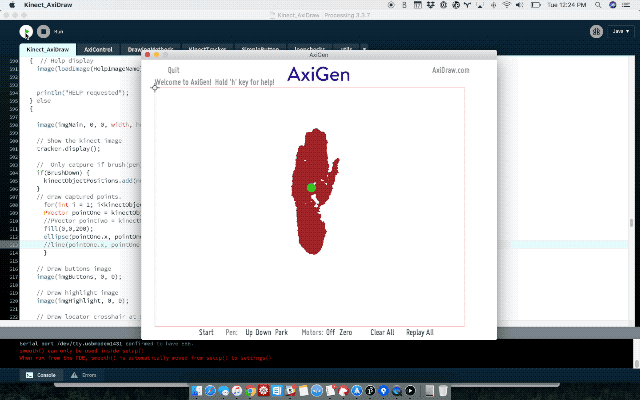

# kinect-axidraw
Draw with your body. Use Kinect motion sensor to directly control AxiDraw plotter.  

This is built upon the AxiGen Processing sketch https://github.com/evil-mad/AxiDraw-Processing from Evil Mad Scientist Labs and  https://github.com/shiffman/OpenKinect-for-Processing by Daniel Shiffman.  See also:  http://shiffman.net/p5/kinect/

## Usage
1. Connect Kinect via USB. I’m using XBox 360 Model: 1414. Read more here about compatibility and different device options: https://shiffman.net/p5/kinect/.  I’m currently only supporting Model: 1414.
2. Connect [AxiDraw v3](https://www.axidraw.com/) via usb.
3. Insert writing device & start drawing!

## Keys
* q - Return to home position
* b - toggle pen up/down
* k - toggle Kinect drawing mode

Keys 1 - 9 toggle motor speed. 1 is slowest, 9 is fastest, 5 is default.

## Known Issues
I’ve done nothing to smooth motor jiggle. Performance is smoother at slower speeds. I hope to smooth out the motion at higher speeds.

## Are you using this?
If you try this or use it for something would you connect with me? I’d love to hear about it =)
